# Australian Census Augmentation Tool

[](https://github.com/cauldnz/abs-census-augmentor/actions/workflows/test.yml)

Augment Australian location datasets with ABS Census data at the SA2 statistical area level. Use it as a CLI tool against CSV files, or as a Python library against a `pandas.DataFrame`.


<details>
<summary>Scene-by-scene</summary>

<!-- BEGIN demo-frames: demo -->
<!-- generated by `make demos`; do not edit by hand -->
| 1. Input | 2. Config | 3. Run | 4. Output |
| :-: | :-: | :-: | :-: |
| [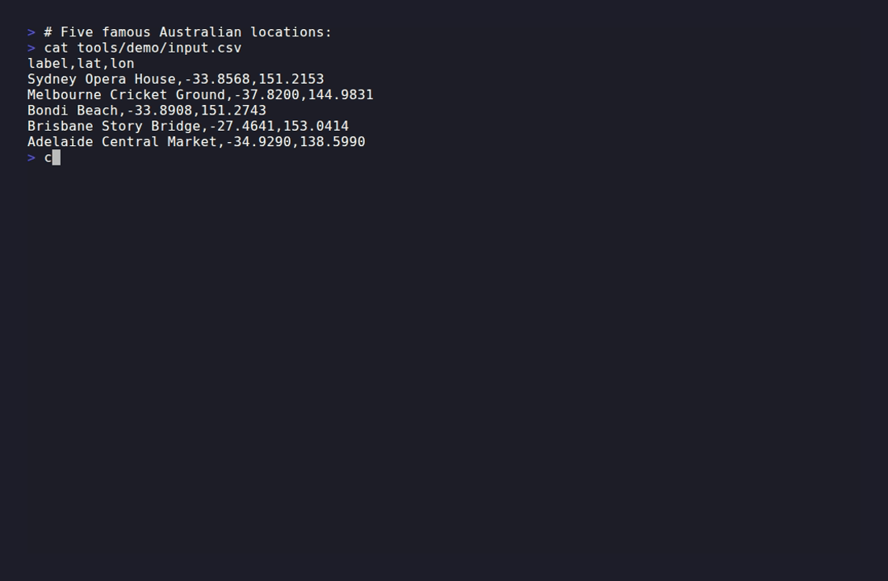](docs/frames/demo-1-input.png) | [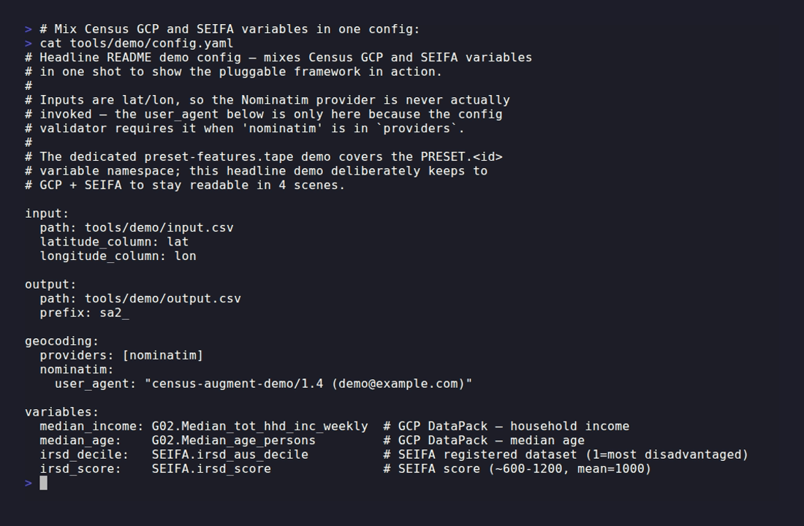](docs/frames/demo-2-config.png) | [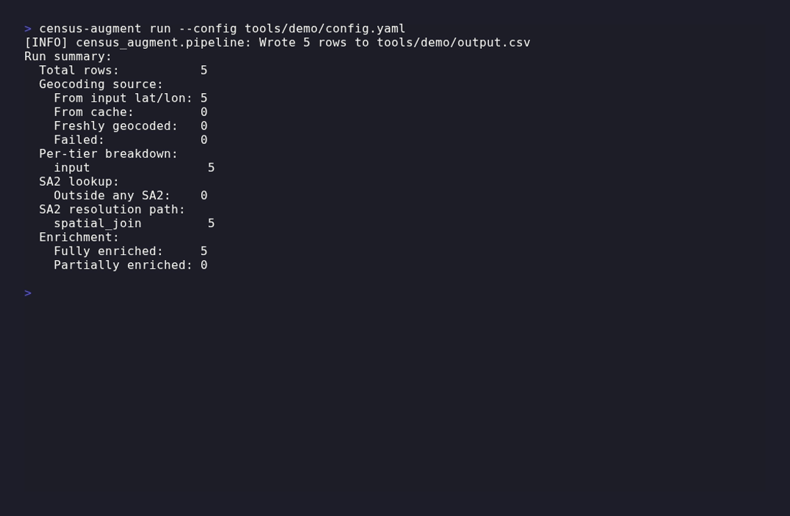](docs/frames/demo-3-run.png) | [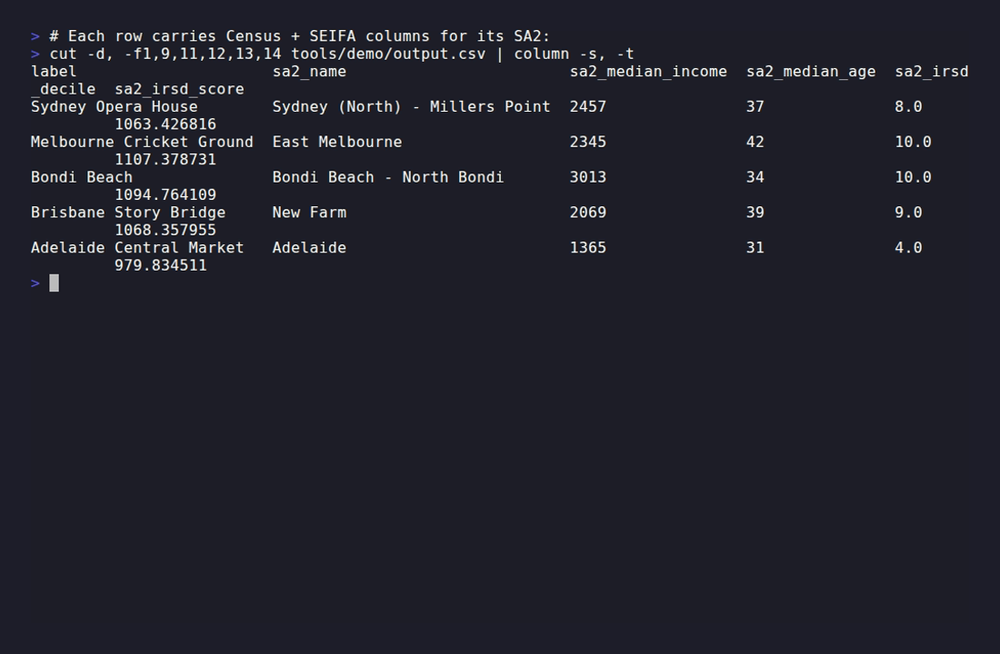](docs/frames/demo-4-output.png) |
<!-- END demo-frames: demo -->

</details>

```
Input → Geocoding (G-NAF tiered → Nominatim) → SA2 (MB fast path → spatial fallback) → Census Enrichment → Output
```

For each location row, the pipeline resolves coordinates (using your input lat/lon if present, else geocoding the address through G-NAF's three offline match tiers and falling back to Nominatim), looks up which SA2 the point falls in, and merges in your chosen variables from any registered dataset. G-NAF Core, ASGS boundaries, Census DataPacks, the registered datasets, and Nominatim responses all cache locally so re-runs are fast.

The GCP DataPack is one entry in a registry alongside SEIFA, ERP (regional population), DSS (welfare payments), ABS Personal Income, ABS Building Approvals (at both SA2 and LGA granularity), and AIHW Mental Health Prescriptions — plus a dozen-plus curated PRESET ratios (`pct_renters`, `pct_drive_to_work`, `housing_supply_rate`, …) that bake in the right denominators. Declare them in one line: `variables: {pct_renters: PRESET.pct_renters}`.

## See it in action

### Discover what's available

What datasets and PRESETs ship with the tool, and what each one's schema looks like:


<details>
<summary>Scene-by-scene</summary>

<!-- BEGIN demo-frames: discover-datasets -->
<!-- generated by `make demos`; do not edit by hand -->
| 1. List | 2. Schema | 3. Spec | 4. Presets |
| :-: | :-: | :-: | :-: |
| [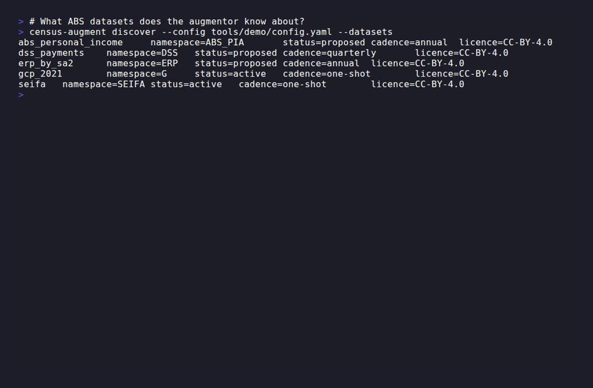](docs/frames/discover-datasets-1-list.png) | [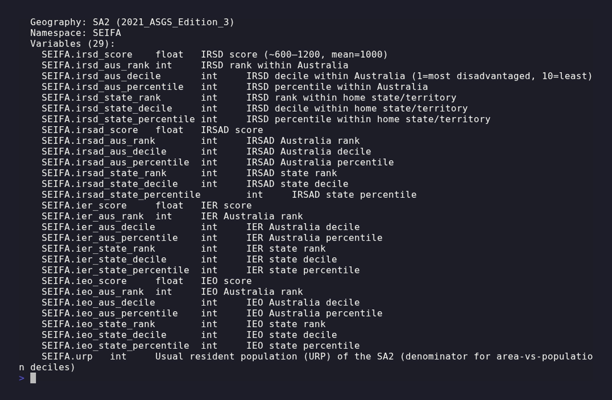](docs/frames/discover-datasets-2-schema.png) | [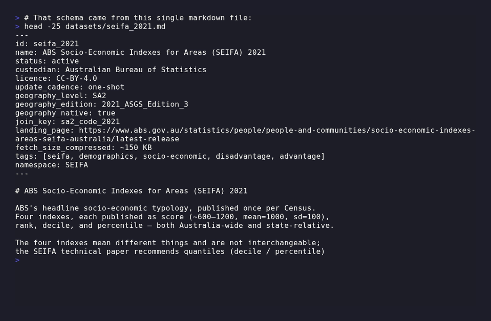](docs/frames/discover-datasets-3-spec.png) | [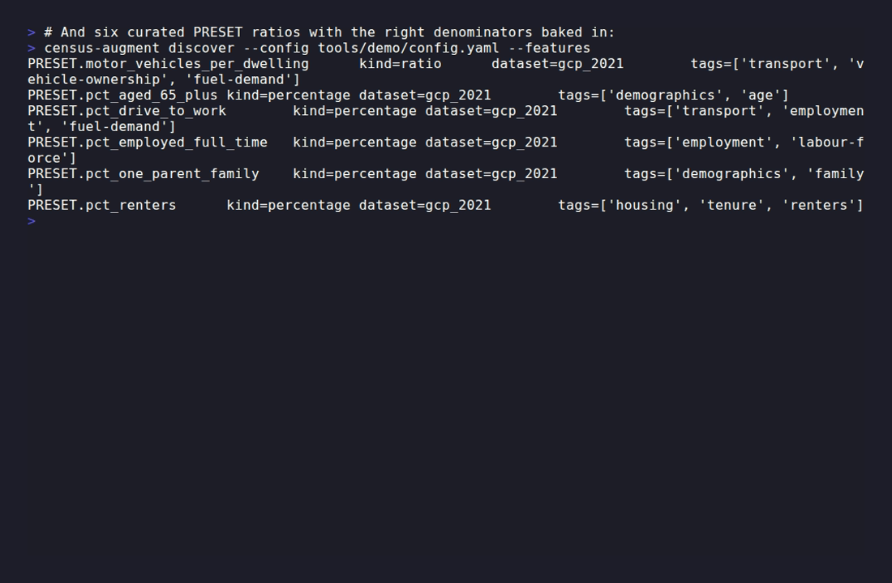](docs/frames/discover-datasets-4-presets.png) |
<!-- END demo-frames: discover-datasets -->

</details>

### PRESETs in a config

How a PRESET feature gets used end-to-end — single config line, pipeline auto-loads the source columns, output table has the computed ratio:


<details>
<summary>Scene-by-scene</summary>

<!-- BEGIN demo-frames: preset-features -->
<!-- generated by `make demos`; do not edit by hand -->
| 1. Spec | 2. Config | 3. Run | 4. Output |
| :-: | :-: | :-: | :-: |
| [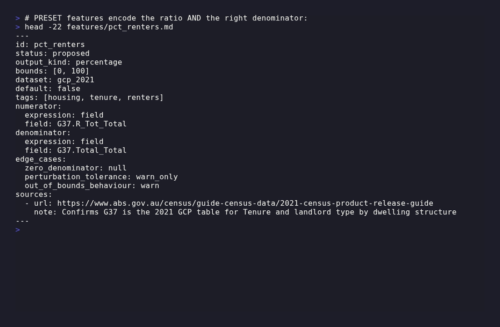](docs/frames/preset-features-1-spec.png) | [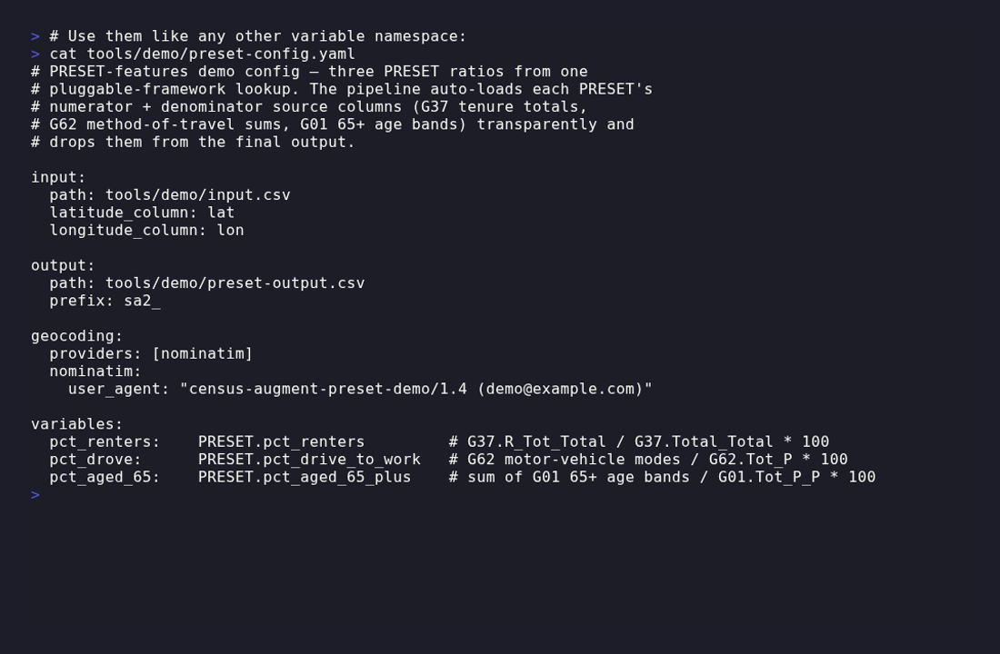](docs/frames/preset-features-2-config.png) | [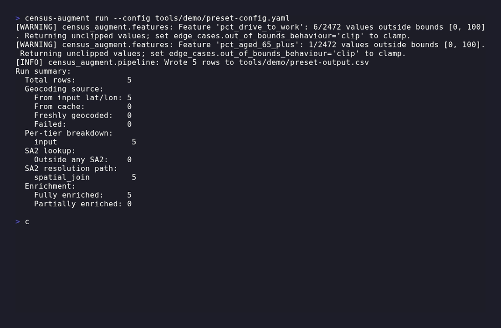](docs/frames/preset-features-3-run.png) | [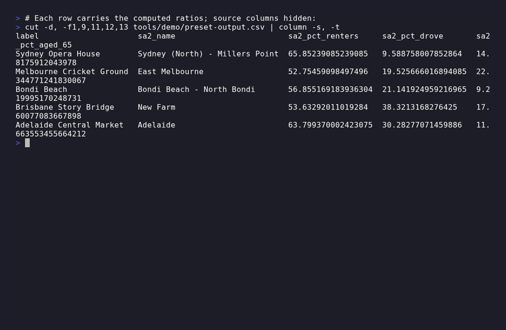](docs/frames/preset-features-4-output.png) |
<!-- END demo-frames: preset-features -->

</details>

## Install

Requires Python 3.11+ and [`uv`](https://github.com/astral-sh/uv) (recommended) or `pip + venv`.

```bash
uv pip install -e ".[dev]"
```

## Hello world

```python
import pandas as pd
from census_augment import Pipeline

pipeline = Pipeline.create(
    variables={
        "median_age": "G02.Median_age_persons",
        "median_household_income_weekly": "G02.Median_tot_hhd_inc_weekly",
        "total_population": "G01.Tot_P_P",
    },
    user_agent="my-app/1.0 (me@example.com)",
    latitude_column="lat",
    longitude_column="lon",
)

df = pd.DataFrame({
    "label": ["Sydney Opera House", "Melbourne MCG", "Open ocean"],
    "lat":   [-33.8568,             -37.8200,        -35.0],
    "lon":   [151.2153,              144.9831,        155.0],
})

result = pipeline.augment(df)
result.df                        # original + geo + sa2 + enrichment columns
```

Prefer the CLI? Drop a `config.yaml` next to your CSV and run `census-augment run --config config.yaml`.

First call downloads ~90 MB of ABS data into the user cache; subsequent calls are instant.

## Where to go next

The handbook lives in [`docs/`](docs/index.md):

- [Library usage](docs/usage-library.md) — `Pipeline.augment(df)`, `AugmentResult`, filtering, examples.
- [CLI usage](docs/usage-cli.md) — full `census-augment` command reference.
- [Configuration](docs/configuration.md) — `config.yaml` schema and cache locations.
- [G-NAF setup](docs/gnaf-setup.md) — cache vs remote mode, prefetch, bring-your-own.
- [Development](docs/development.md) — `make` targets, dev container, contributing.

Also: [`spec.md`](spec.md) (design source of truth), [`CHANGELOG.md`](CHANGELOG.md), and runnable [`examples/`](examples/).

## License

MIT — see [`LICENSE`](LICENSE). G-NAF data is licensed separately under Geoscape's [Open G-NAF EULA](https://geoscape.com.au/legal/g-naf-end-user-licence-agreement/).
